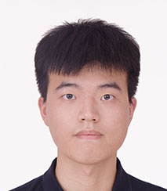

**Role**: Ph.D. Student  
**Research Interests**: Generalized nash equilibrium problem in intelligent transportation  
**Bio**: Chenglin received his ​Bachelor of Information Management and Information Systems from Northeastern University, followed by a ​Master of Management Science and Engineering from Shenzhen University. His research centers on ​Generalized Nash Equilibrium Problems (GNEPs) in intelligent transportation systems.

