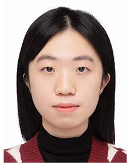

# Yiling Luo (2023 Fall)

**Role**: Mphill Student  
**Research Interests**: Optimal transit design, Transportation equity.  
**Bio**: Yiling earned her BSc in Statistics from Southern University of Science and Technology and subsequently obtained a MSc degree in Business Analytics from the Hong Kong University of Science and Technology. Her research interests focus on transportation equity and the policy design of public transit systems.

