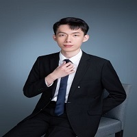

# Ziye Guo

**Role**: Research Assistant 
**Research Interests**: Federated Learning.  
**Bio**: Ziye graduated from Bejing University of Post and Telecommunications. His research interst includes federated learning and LLM agents.

#
