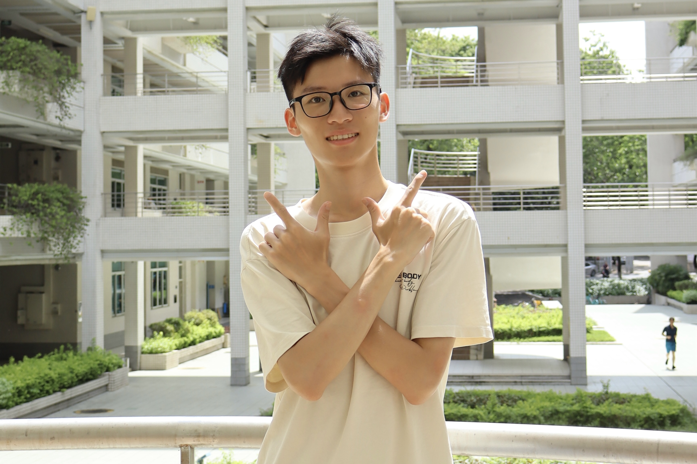

# Shangtao Wu

**Role**: Research Assistant  
**Research Interests**: Vehicle to Grid, Data-driven analysis of electric vehicles, Transportation network modeling.  
**Bio**: Shangtao received his bachelor's degree in South China University of Technology in 2025. His research interests include transportation-energy integration and transportation network modeling."

