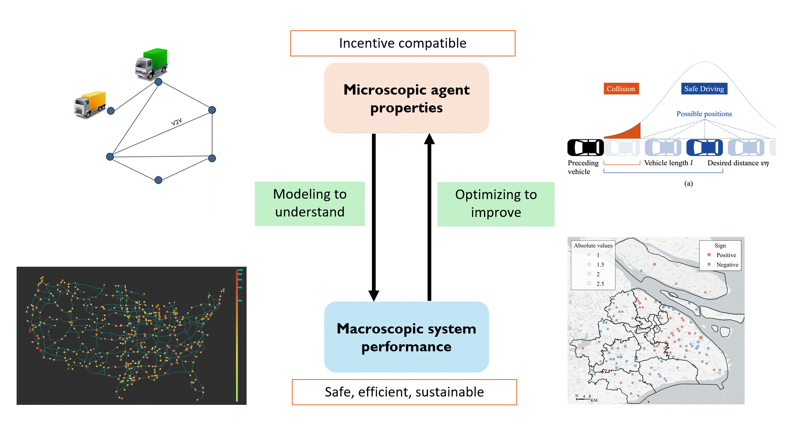

<!-- logo图像 -->

<!-- logo图像 -->

<!-- 分段注释: 文字描述部分开始 -->
Led by Dr. Xiaotong Sun, the Lab of Mobility Optimization and DEcision Science (MODES) at HKUST (Guangzhou) focuses on the **planning, operation, and regulation** of multi-modal transportation systems empowered by emerging technologies. Drawing on analytical optimization, game theory, and data-driven approaches, MODES advances research through a **dual lens**: modeling to understand how complex transportation systems operate, and optimizing to enhance their performance.
<!-- 分段注释: 文字描述部分结束 -->

<!-- 分段注释: Research Highlights部分开始 -->
Research Highlights
======
 
<!-- 分段注释: Research Highlights部分结束 -->

   
<!-- 分段注释: Recently Updates部分开始 -->
Recently Updates
======

  自动从_updates文件夹获取最新的5条更新
  按日期降序排列，只显示最近的内容


  
     <!-- 核心逻辑：
       1. site.updates - Jekyll自动读取_updates文件夹中的所有文件，形成一个集合
       2. | sort: 'date' - 管道符后的sort按照每个文件中的date字段排序
       3. | reverse - 反转排序（从新到旧）
       4. assign sorted_updates - 将排序后的结果赋值给变量sorted_updates
  -->
  
   <!-- 循环遍历sorted_updates变量 limit:5 - 限制只循环前5个元素（最新的5条更新）;每次循环中，当前项存储在update变量中-->
    

      <!-- 标题链接 -->
      <h3 style="margin-bottom: 5px; font-size: 1.1em;">
        <!--<a href="{{ update.url | relative_url }}">{{ update.title }}</a>-->
        <a href="{{ '/updates/' | relative_url }}">{{ update.title }}</a>
      </h3>
      <!-- 日期 -->
      

        {{ update.date | date: "%B %d, %Y" }}
      

    

  

  <a href="{{ '/updates/' | relative_url }}" style="font-weight: bold;">View All Updates →</a>

<!-- 分段注释: Recently Updates部分结束 -->
