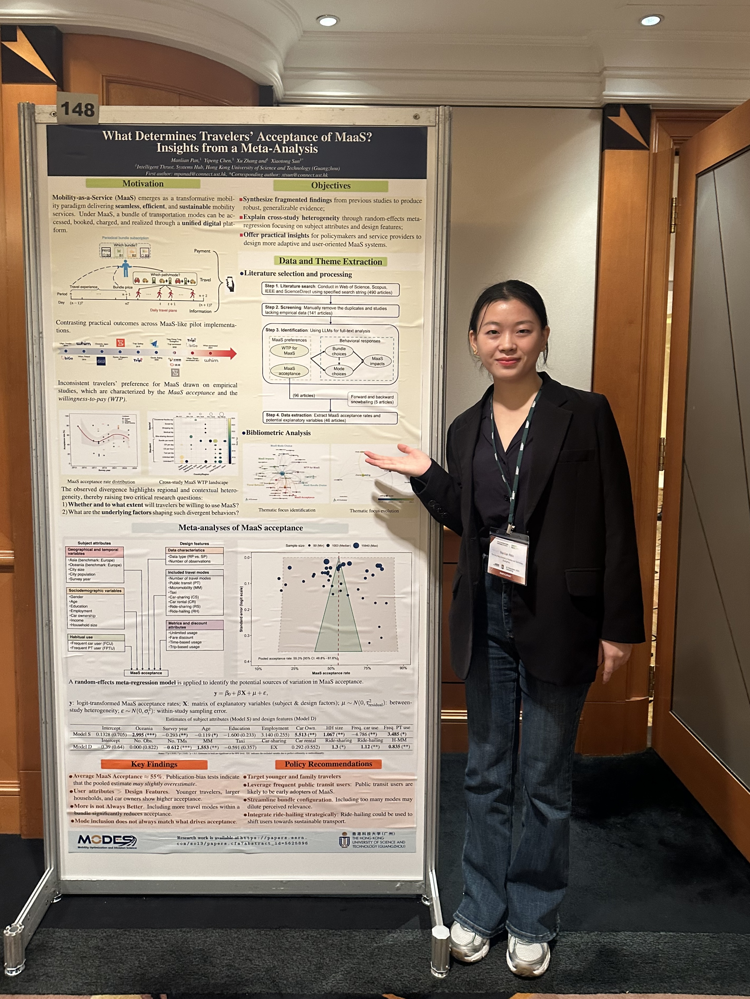

And delivered two presentations. 
### 1. A Deep Reinforcement Learning Framework for Hub-based Truck Platoon Schedule Coordination 
**Presenter:**  Xinzhu Ren 
**Session:** B2, Cooperative Autonomous Driving, led by Dr. Xiaotong Sun. 

### 2. What Determines Traveler Acceptance of MaaS? Insights from a Meta-Analysis (148) 
**Presenter:** Manlian Pan 
**Session:** Poster. 

 
